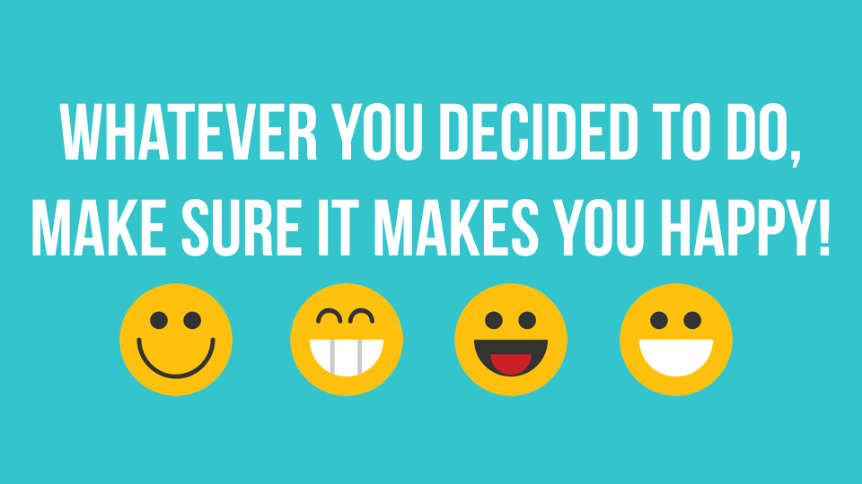
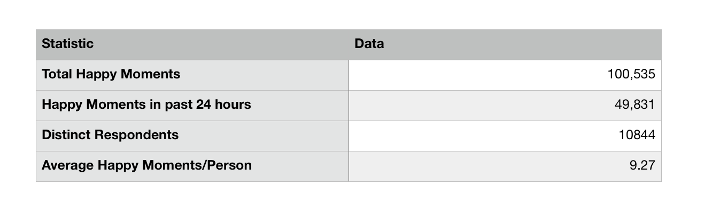
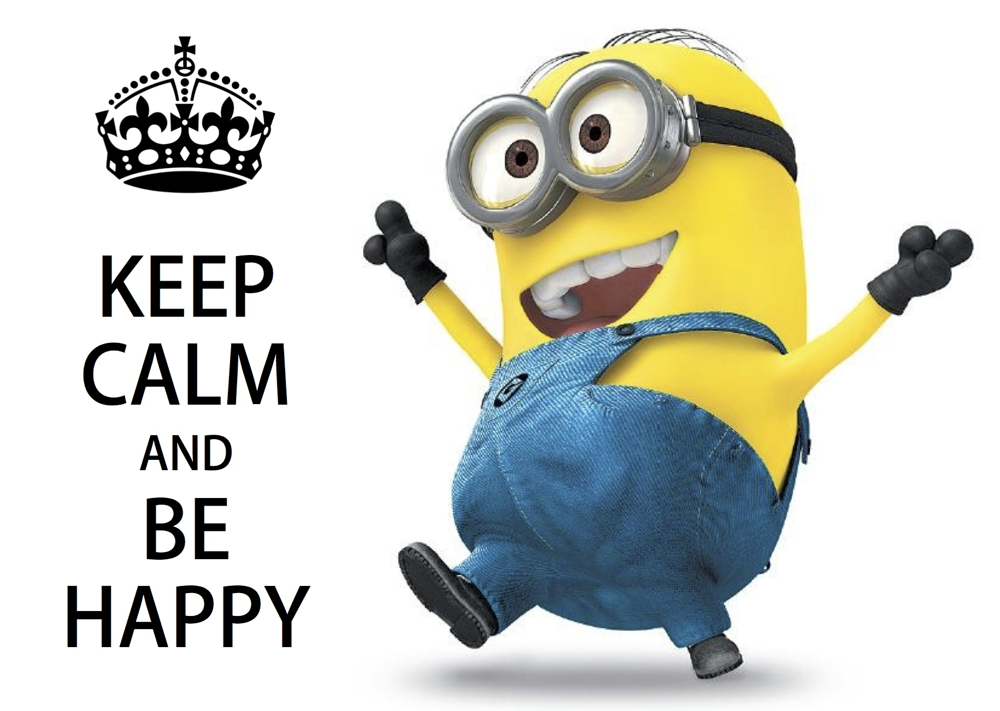

```{r setup, include=FALSE}
knitr::opts_chunk$set(warning = FALSE)
knitr::opts_chunk$set(message = FALSE)
library(ggplot2)
```

```{r, echo=FALSE}
packages.used=c("rvest", "tibble", "qdap", 
                "sentimentr", "gplots", "dplyr",
                "tm", "syuzhet", "factoextra", 
                "beeswarm", "scales", "RColorBrewer",
                "RANN", "tm", "topicmodels")

# check packages that need to be installed.
packages.needed=setdiff(packages.used, 
                        intersect(installed.packages()[,1], 
                                  packages.used))
# install additional packages
if(length(packages.needed)>0){
  install.packages(packages.needed, dependencies = TRUE)
}

# load packages
library("rvest")
library("tibble")
library("sentimentr")
library("gplots")
library("dplyr")
library("tm")
library("syuzhet")
library("factoextra")
library("beeswarm")
library("scales")
library("RColorBrewer")
library("RANN")
library("tm")
library("topicmodels")
library("xml2")
library("ggthemes")
```

##What made you happy today? 

{width=600px}

There are countless moments in our daily life that can bring different emotions: happy, sad, excited, angry,etc. In this project, we are interested in one question: What makes people happy? In order to figure out the categories of main reasons that make people happy and the characteristics of happy moments for different groups of people, natrual language processing and text mining methods were applied. 

##Overview: causes of happiness


```{r, echo=FALSE}
clean_hm <- read.csv("../data/cleaned_hm.csv", stringsAsFactors = FALSE)
clean_hm <- clean_hm[clean_hm$reflection_period=="24h",]
#dim(clean_hm)
```

```{r, echo=FALSE}
demo <- read.csv("../data/demographic.csv", stringsAsFactors = FALSE)

demo$age <- gsub("yrs","",demo$age)
demo$age <- gsub(".0","",demo$age)
#length(unique(demo$wid))
```

```{r, echo=FALSE}
packages.used=c("tm", "wordcloud", "RColorBrewer", 
                "dplyr", "tydytext")

# check packages that need to be installed.
packages.needed=setdiff(packages.used, 
                        intersect(installed.packages()[,1], 
                                  packages.used))
# # install additional packages
# if(length(packages.needed)>0){
#   install.packages(packages.needed, dependencies = TRUE,
#                    repos='http://cran.us.r-project.org')
# }

library(tm)
library(wordcloud)
library(RColorBrewer)
library(dplyr)
library(tidytext)
```



The dataset used for this analysis is HappyDB. The HappyDB is a corpus of 100,000 crowd-sourced happy moments. It contains happy moments (in past 24 hours or 3 months ago) and some additional information in addition to original happy moments, like work id, age, gender, marital status for respondants. The table above is an overview of the happydb dataset. 
Table view is not enough to show key words of the happy moments, so it is time to show a wordcloud plot.

```{r, echo=FALSE}
ff.all<-Corpus(VectorSource(clean_hm$cleaned_hm))

ff.all<-tm_map(ff.all, stripWhitespace)
ff.all<-tm_map(ff.all, content_transformer(tolower))
ff.all<-tm_map(ff.all, removeWords, stopwords("english"))
ff.all<-tm_map(ff.all, removeWords, character(0))
to_remove = c("happy","went","time","got","really","nice","yesterday","one","finally","today","life","
                came","get","able","great","well","first","year","lot","morning","getting","felt","like","moment","new","week","just","going","long","see","good","back","came","found","hours","month","months","weekend","two","little","days","took","around","people","event","now","big","can","together","made","day","years","much","last","will","best","weeks","happiest","make","fun","friends","favorite","feel","past","started","working","ago","happiness","things")
ff.all <- tm_map(ff.all, removeWords, to_remove)
ff.all<-tm_map(ff.all, removePunctuation)

tdm.all<-TermDocumentMatrix(ff.all)

tdm.tidy=tidy(tdm.all)

tdm.overall=summarise(group_by(tdm.tidy, term), sum(count))
```


```{r}
wordcloud(tdm.overall$term, tdm.overall$`sum(count)`,
          scale=c(5,0.5),
          max.words=50,
          min.freq=1,
          random.order=FALSE,
          rot.per=0.3,
          use.r.layout=T,
          random.color=FALSE,
          colors=brewer.pal(9,"Blues"))
```

From the wordcloud plot, it looks that "work" made a majority of people happy, at least in the past 24 hours, which is unexpected. We can also tell that people like "friend", "daughter", food, family are also strong factors that can bring people happiness. 

```{r, echo=FALSE}
#read files from topic_dict file as topics

entertainment <- read.csv("../data/topic_dict/entertainment-dict.csv", header = FALSE, col.names = "entertainment")
exercise <- read.csv("../data/topic_dict/exercise-dict.csv", header = FALSE, col.names = "exercise")
familyd <- read.csv("../data/topic_dict/family-dict.csv", header = FALSE, col.names = "family")
food <- read.csv("../data/topic_dict/food-dict.csv", header = FALSE, col.names = "food")
people <- read.csv("../data/topic_dict/people-dict.csv", header = FALSE, col.names = "people")
pets <- read.csv("../data/topic_dict/pets-dict.csv", header = FALSE, col.names = "pets")
school <- read.csv("../data/topic_dict/school-dict.csv", header = FALSE, col.names = "school")
shopping <- read.csv("../data/topic_dict/shopping-dict.csv", header = FALSE,col.names = "shopping")
work <- read.csv("../data/topic_dict/work-dict.csv", header = FALSE, col.names = "work")

#dict <- data.frame(topics = c(entertainment,exercise,familyd,food,people,pets,school,shopping,work))
```

```{r, echo=FALSE}
#get each word with related topic
get_words <- function(x){
  df <- data.frame(x, rep(names(x), length(x)))
  names(df) <- c("words","topics")
  return(df)
}
ls <- c(entertainment,exercise,familyd,food,people,pets,school,shopping,work)

dict <- data.frame()
for (i in 1:length(ls)) {
  dict <- rbind(dict,get_words(ls[i]))
  #build a dataframe called dict which stores words with their topics
}
```

After the overview, it is obvious that things which made people happy can be approximately classified into several classes: people, family, food, pets, amusements, which almost perfectly matches the exsiting topics in topic_dict file from the original happydb dataset. Thus, I decided to use those as the topics for terms of happy moments. 

##Topic Analysis

```{r, echo=FALSE}
my_df <- merge(clean_hm, demo, by="wid")
#merge clean_hm and demographics dataframes together
```

```{r, echo=FALSE}
#do some data cleaning before using them for analysis

my_df$age <- as.numeric(my_df$age)
my_df <- my_df %>% filter(age > 5 & age < 100)
my_df <- my_df %>% mutate("age_group"=ifelse(age < 25, "youth",ifelse(age >= 25 & age < 65, "adults", "seniors")))
my_df <- my_df[-31208,]


dict$words <- as.character(dict$words)
dict$topics <- as.character(dict$topics)
```

```{r, echo=FALSE}
#a function take one sentence as parameter, assign the topic of it
find_topic <- function(x){
  v <- c()
  for (i in 1:length(x)) {
    w <- x[i]
    if(w %in% dict$words){
      v <- c(v,dict$topics[dict$words==w])
    }
  }
  topic <- names(which.max(table(v)))
  
  return(ifelse(is.null(topic),"none", topic))
}


#clean each sentence and separate it into words
get_tidy <- function(temp){
  #temp <- my_df$cleaned_hm[1]
  dd.all<-Corpus(VectorSource(temp))
  
  dd.all<-tm_map(dd.all, stripWhitespace)
  dd.all<-tm_map(dd.all, content_transformer(tolower))
  dd.all<-tm_map(dd.all, removeWords, stopwords("english"))
  dd.all<-tm_map(dd.all, removeWords, character(0))
  dd.all<-tm_map(dd.all, removePunctuation)
  
  dd.all<-TermDocumentMatrix(dd.all)
  
  dd.tidy=tidy(dd.all)
  print(which(my_df$cleaned_hm==temp))
  return(dd.tidy$term)
}

#apply the get_tidy function to get tidied data of every cleaned sentence
#this process will run about 10 minutes, so comment for efficiency

#a <- sapply(my_df$cleaned_hm, get_tidy)
```


```{r, include=FALSE}
#find out the frequency of appearance of words in a sentence for each topic dictionary
#assign the sentence with topic of highest frequency

# topic <- vector(length=nrow(my_df))
#   # topic[i] <- find_topic(dd.tidy)
#   i = 0
#   for (s in a) {
#     i = i+1
#       topic[i] <- find_topic(s)
#   }
```

```{r, echo=FALSE}
#write a new csv file to store the list of topics of each sentence that found by above procedures, for efficiency

#write.csv(topic,"topic_term.csv")

topic <- read.csv("../data/topic_term.csv")
```

The below graph shows the frequency of each topic. Unlike that showed in wordcloud plot, this bar plot tells that "family" is the most important influencing factor of making people happy, rather than "work". Thus, the reason that "work" is so conspicuous in wordcloud plot is that, although mentioning "work" in the moment of happiness, the true meaning that the sentence would like to convey may be quite different than "working makes people happy". 
For example, "I went to shopping with my friends after work." The main point of this sentence is "after-work activity make me happy" instead of "work" itself. Thus, topic selection and modeling is indispensable in natural language processing and data analysis. 

```{r}
my_df$topic <- as.character(topic$x)

my_df <- my_df[my_df$topic != "none",]
term_count <- table(my_df$topic)
barplot(term_count[order(term_count)], las=2, horiz = T, main = "Topic Frequency", col="lightpink",border = "lightseagreen")
```


##What is the most popular entertainment ways/sports/people that made you happy?

As topics were selected, we are now interested in the most popular activities/people under some representative topics. 
####Top prevalent entertainment ways

```{r}
cloud_graph <- function(x,color1, color2,t){
  x.tidy <- tdm.tidy[tdm.tidy$term %in% unlist(x),]
  x.overall <- x.tidy %>% group_by(term) %>% summarise(sum(count))
  freq <- table(x.tidy$term)
  freq <- freq[order(freq,decreasing = T)][1:5]
  par(mfrow = c(1,2))
  wordcloud(x.overall$term, x.overall$`sum(count)`,
          scale=c(3,0.5),
          max.words=50,
          min.freq=1,
          random.order=FALSE,
          rot.per=0.3,
          use.r.layout=T,
          random.color=FALSE,
          colors=brewer.pal(9,color1))
  barplot(rev(freq), horiz = T, xlab = "count", col = color2,las=2, main = t)
}

cloud_graph(entertainment,"Oranges","lightsalmon","Entertainment")
```

From the wordcloud plot and barplot above, most people prefer visual enjoyment like watching movies, videos. Next is reading books. Films ans shows are usually easy with few complicated thoughts needed. Moreover, they have attractive visual appeal, which can won the hearts of audiences. In addition, the respondents of the survey are workers, generally, watching something is always the first choice of relaxing after work.  

###popular sports

```{r}
cloud_graph(exercise, "Greens", "lightgreen", "Exercise")
```

For exercises, walking won the first prize. In this busy society, walking is one of the most costless and efficient way of keeping healthy. People can walk anytime and anywhere. Replacing the 10-minute driving to work with 30-minute walk would be a good start of a nice day. Besides, going to gym and workout to get a better-look body shape is also the favorites these days. There is nothing better than have muscular body shape, not only healthy, but also beautiful. 

###family member
```{r}
cloud_graph(familyd,"Reds","lightcoral", "Family")
```


###people that make us happy
```{r}
cloud_graph(people,"Accent", "honeydew", "People")
```

The terms of topic "People" and "Family" are quite similar. Most of them are marital partners, kids and friends. Spending time with family and friends can always bring happiness. 


##What make different groups of people happy?

Although taking a look into each topics is needed, analyzing between groups is also inevitable.

```{r, echo=FALSE}
my_df$age_group<- factor(my_df$age_group, levels = c("seniors","adults","youth"))
```


####Reasons for different Age Groups

```{r, echo=FALSE}
library(vcd)
mosaic(topic~age_group,direction = c("v", "h"),
       labeling = labeling_border(rot_labels = c(0, 90, 0, 0)), 
       gp = gpar(fill = c("lightsalmon", "powderblue"), col = "white"),
       spacing = spacing_equal(sp = unit(0, "lines")),my_df)
```

```{r, echo=FALSE}
pct <- function(t){
  return(round(t/sum(t),2)*100)
}
pie_graph <- function(t,x){
  lbls <- paste(abbreviate(names(t)), pct(t)) 
  lbls <- paste(lbls,"%",sep="") 
  pie(x=t,labels = lbls, main = x)
}
par(mfrow = c(1,3))
pie_graph(table(my_df[my_df$age_group=="youth",]$topic), "youth")
pie_graph(table(my_df[my_df$age_group=="adults",]$topic),"adults")
pie_graph(table(my_df[my_df$age_group=="seniors",]$topic), "seniors")
```

The mosaic plot provided a rough distribution of topics in each age group. For adults (25~65) and seniors(>65), happiness mostly comes from family; nevertheless, young people are more likely to to get gratification through food and friends. In other words, as getting older, the proportion of "family" accounts more of the reasons for feeling happy. 

####Topic vs Parenthood

```{r}
mosaic(topic~parenthood,direction = c("v", "h"),
       labeling = labeling_border(rot_labels = c(0, 90, 0, 0)), 
       gp = gpar(fill = c("chocolate", "thistle3"), col = "black"),
       spacing = spacing_equal(sp = unit(0.2, "lines")),my_df[my_df$parenthood!="",])

```

```{r}
par(mfrow = c(1,2))
pie_graph(table(my_df[my_df$parenthood=="y",]$topic), "yes")
pie_graph(table(my_df[my_df$parenthood=="n",]$topic), "no")
```


####Topics vs Marital Status

```{r, echo=FALSE}
my_df$marital <- gsub("divorced|separated|widowed","div/sep/wid", my_df$marital)
my_df$marital <- factor(my_df$marital, levels = c("single","married","div/sep/wid"))
```


```{r, echo=FALSE}
mosaic(topic~marital,direction = c("v", "h"),
       labeling = labeling_border(rot_labels = c(-20, 90, 0, 0)), 
       gp = gpar(fill = c("darkseagreen", "lightgoldenrod2"), col = "white"),
       spacing = spacing_equal(sp = unit(0, "lines")),my_df)

par(mfrow = c(1,3))
pie_graph(table(my_df[my_df$marital=="div/sep/wid",]$topic), "div/sep/wid")
pie_graph(table(my_df[my_df$marital=="married",]$topic), "married")
pie_graph(table(my_df[my_df$marital=="single",]$topic), "single")
```

For people who have their own small family (married group and two-parent group), obviously family is the core of their life. Single people often live in a casual style, food, social network and leisure activities weights more in their happiest moments. For divorced/separated/widowed group, proportion of family, food and people are similar in their happy day. 


####Topic vs Gender

```{r}
mosaic(topic~gender,direction = c("v", "h"),
       labeling = labeling_border(rot_labels = c(0, 90, 0, 0)), 
       gp = gpar(fill = c("lightcyan3", "indianred3"), col = "black"),
       spacing = spacing_equal(sp = unit(0.2, "lines")),my_df[my_df$gender!="o" & my_df$gender!="" ,])
```

```{r}
par(mfrow = c(1,2))
pie_graph(table(my_df[my_df$gender=="f",]$topic), "female")
pie_graph(table(my_df[my_df$gender=="m",]$topic), "male")
```

From plots above, evidently, females concentrate more in family life than males do. The percentage of family in females' happy moments is 9% more than that of males'. The 9% was separated to exercise, food, entartainment and work. That is to say, males focus more on themselves than females do, which might due to the different social roles they play. 

##Summary
By analyzing 100535 happy moments in past 24 hours, there are two insteresting findings:
1. Instead of entertainmens, family is the most consequential factor that make people. It becomes more and more influential as people getting older.
2. Different groups of people do feel happy because of different kind of things. We can make predictions on reason of feeling happy by the characters that a people have or inversely. For example, a married female adult is more likely to gain happiness from family related things; however, if the main topic of a happy moment is "food", the person will have high probability to be a single young male.

{width=600px}

##References:

DataSet: From HappyDB https://rit-public.github.io/HappyDB/ </br>

Happy Image: https://www.lifehack.org/570376/15-things-stop-doing-you-want-truly-happy </br>
             http://www.littlestarblog.com/music-monday-24-hours-of-happy/


